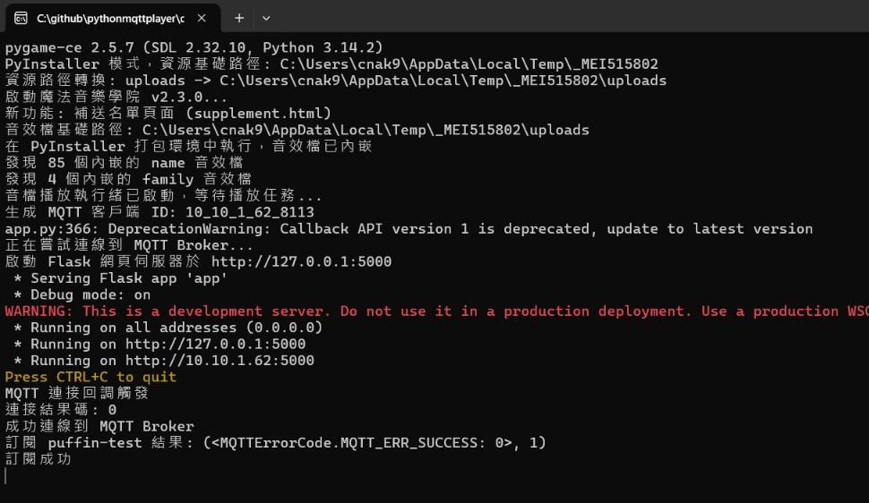
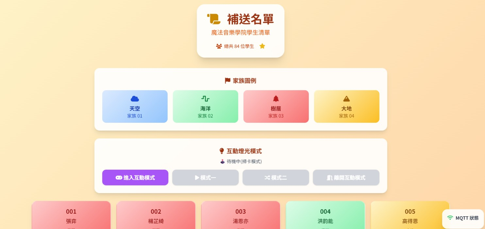

# 🎵 魔法音樂學院 家族儀式 使用手冊

> 本手冊給現場操作人員使用，分為「軟體篇」（電腦端操作）與「硬體篇」（刷卡機/燈光裝置）兩部分。

---

## 📘 軟體篇：電腦端操作

### 1. 解壓縮並執行程式

1. 找到 **魔法音樂學院_完整版** 的壓縮檔，解壓縮到電腦裡任一資料夾。
2. 打開解壓縮後的資料夾，雙擊執行 **魔法音樂學院_完整版.exe**。
3. 執行後會跳出一個黑底文字視窗（如下圖，**畫面一**），這代表程式正在背景執行，**請不要關閉這個視窗**，關掉程式就會停止運作。



> ✅ 看到最後幾行出現「成功連線到 MQTT Broker」「訂閱成功」，就代表程式已經準備好了。

### 2. 開啟操作介面

1. 從畫面一的視窗中，找到網址 `http://127.0.0.1:5000`。
2. 把這個網址**複製，貼到 Chrome 瀏覽器**的網址列並開啟，就會看到「魔法音樂圖書館」主頁面（上傳音效、查看音效清單用）。
3. 如果要進入**現場控制後台**，在網址後面加上 `/sup`，也就是打開：

   ```
   http://127.0.0.1:5000/sup
   ```

   就會看到補送名單控制頁（如下圖，**畫面二**），這是**活動現場主要會用到的畫面**。



### 3. 控制後台功能說明（畫面二）

畫面二由上到下分成三個區塊：

| 區塊 | 功能 |
|---|---|
| **家族圖例** | 對照四個家族的顏色與名稱：天空(01)、海洋(02)、樹居(03)、大地(04)，方便對照下方名單卡片的顏色 |
| **互動燈光模式** | 控制裝置上的 LED 燈光效果，配合活動橋段使用（詳見下方說明） |
| **姓名名單** | 每位學生一張卡片，若刷卡漏播或裝置沒反應，**直接點擊該學生的卡片**就能手動補送播放指令 |

#### 互動燈光模式按鈕怎麼用

一共四個按鈕，**由左到右依序按**，不要跳著按：

1. **進入互動模式**：讓所有裝置的燈光暫時關閉、進入待命，準備開始燈光秀。（這顆可以重複按沒關係，如果按了裝置沒反應可以再按一次補送）
2. **模式一**：觸發第一段燈效（漸亮漸暗，約 8 秒）。
3. **模式二**：觸發第二段燈效（隨機閃燈，約 7 秒），結束後裝置會自動恢復成一般刷卡待機狀態。
4. **離開互動模式**：緊急退出鍵，不管裝置目前卡在哪個狀態，按下去就會立刻關燈、恢復成一般刷卡模式。**如果現場燈光秀出狀況，直接按這顆就對了。**

#### 補送名單怎麼用

- 名單上的卡片會依家族顯示對應顏色。
- 學生刷卡成功播放過後，卡片會變成灰色並標示「已播放」。
- 若某位學生刷卡沒反應（可能卡片故障或裝置沒收到訊號），**直接點擊該學生的卡片**，系統就會補送一次播放指令。

### 4. 開始活動前的檢查

- ⚠️ **記得打開電腦音量，並確認已連接擴音設備（喇叭/音響）**，否則畫面正常但現場聽不到聲音。

---

## 🔧 硬體篇：刷卡機 / 燈光裝置

### 1. 開機前：務必先連 WiFi 熱點

> ⚠️ **這是最容易出錯的步驟，順序不能顛倒！**

現場測試發現 **WiFi 訊號強弱會直接影響裝置運作**，所以每次開機前請依照以下順序操作：

1. **先**打開手機熱點：
   - 名稱：**TDS**
   - 密碼：**333999888**
2. 把手機盡量靠近裝置放置（訊號越強越穩定）。
3. **確認熱點已開啟後，才插上裝置的 USB 電源。**

插電之後就不用再做什麼，裝置會自動開機、連線。

### 2. 開機進度燈號說明

裝置開機時，正面燈號會依序亮起不同顏色，代表目前開機到哪個階段（皆為約 20% 亮度，不會太刺眼）：

| 燈號顏色 | 代表意義 |
|---|---|
| 🔴 紅 | 系統 / 燈條基礎初始化完成 |
| 🟠 橙 | I2C 匯流排就緒 |
| 🟡 黃 | NFC 讀卡模組就緒 |
| 🟢 綠 | WiFi 連線成功 |
| 🔵 藍 | MQTT 連線成功 |
| 🟣 紫 | 系統啟動完成 |
| 🌈 彩虹 | 開機成功，閃示一次彩虹後進入待機 |

> 如果開機燈號卡在某個顏色一直沒有繼續往下跳（例如卡在黃色不變綠），通常代表那個階段有問題（例如 WiFi 連不上），可以參考「WiFi 熱點」步驟重新檢查。

### 3. 待機與刷卡

- **待機時是白燈**，代表裝置正常、等待刷卡。
- **如果白燈暗掉**，代表這台裝置出問題了，現場可以先**改用別台機器**，不用等這台修好再繼續活動。
- 每次刷卡完成後，**需要等待約 15 秒**，白燈才會重新亮起，這時候才能再刷下一張卡。

### 4. 背後指示燈（系統狀態燈）

裝置背後另外有一顆狀態燈，用來判斷系統整體是否正常：

| 燈號狀態 | 代表意義 |
|---|---|
| 🟢 持續亮著 | 系統運作正常 |
| ✨ 慢慢閃爍 | 目前正在「互動燈光模式」中（屬於正常狀態，不用擔心） |
| ⚡ 快速閃爍 | 目前系統有問題，需要處理 |

---

## ✅ 現場開場前檢查清單

- [ ] 手機熱點 **TDS**（密碼 333999888）已開啟，且盡量靠近裝置
- [ ] 裝置已插電開機，開機燈號有跑完到彩虹閃示
- [ ] 裝置正面呈現白燈待機
- [ ] 電腦已執行 `魔法音樂學院_完整版.exe`，黑底視窗保持開啟中
- [ ] Chrome 已開啟控制後台 `http://127.0.0.1:5000/sup`
- [ ] 電腦音量已開啟，且已連接擴音設備
